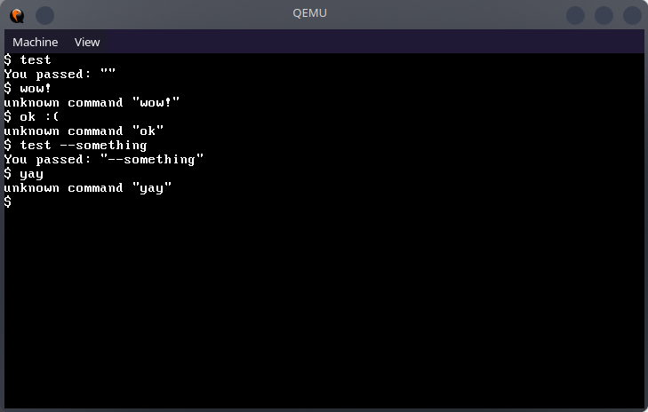

<div align="center">
    <h1>OSDEV</h1>
    
</div>

## About

This is just a _small_ project, writing an "operating system" from scratch with NASM and C++. <br>
Everything from booting to memory management, handling devices, reading the file system, etc. is custom-made.

It is 32bit for now. Will most likely be rewritten for 64bit once I am further educated in this field.


## Building

As of now the `run.sh` file builds, links, and runs the project.

Building and linking requires `nasm`, `g++` and `ld`. <br>
The binary is booted inside `qemu-system-x86_64` through BIOS, no UEFI yet.


## Progress

### Standard C++ library

Yes, so far just C libraries...

[//]: # (Library completion based on https://cplusplus.com)

| Progress | Library                  |
|----------|--------------------------|
| ` 67%`   | [cstddef](./lib/cstddef) |
| `~30%`   | [cstdint](./lib/cstdint) |
| `  5%`   | [cstdio](./lib/cstdio)   |
| `  6%`   | [cstdlib](./lib/cstdlib) |
| ` 22%`   | [cstring](./lib/cstring) |


### Memory management

see: [MemoryManager.h](src/MemoryManager.h)

The current homemade memory management is neither efficient in terms of space and speed
nor safe in the long run. See the file for further details.
It is though very much **made with love** without even knowing how other proper libraries do it.

It does support allocation, reallocation and freeing of memory!

A small "graphic" on how it works:
```
Free memory is stored as sections. Initially it is one big section.
Sections are stored as a double linked list leading to them having quite a bit overhead.

This is how your memory looks with sections of different sizes:
.-------------------------------------------------->
|    |                |                     |      >
'-------------------------------------------------->

The manager is told to allocate a new section of size n.

The first section is too small:
.-------------------------------------------------->
| X    |                |                    |     >
'-------------------------------------------------->

The second section fits n or more:
.-------------------------------------------------->
|      | X              |                    |     >
'-------------------------------------------------->

Since it has more capacity than n it gets split into two sections:
.-------------------------------------------------->
|      | old      | new |                     |    >
'-------------------------------------------------->

The references inside the list get patched up since old will be a gaping hole
in the currently free memory once its gone:
.-------------------------------------------------->
| prec >##########< new |                     |    >
'-------------------------------------------------->

(*old + overhead) is returned as the pointer to allocated memory.
```

Obviously without cleanup/"compounding" of the splintered sections this will
lead to the process running out of space for big data at one point.

As said previously, it is not optimal, it is just the first iteration.


### Drivers

| Progress | Driver                                      |
|----------|---------------------------------------------|
| `~95%`   | [Video Memory Manipulation](./src/text.cpp) |
| `~85%`   | [PS/2 Keyboard](./src/driver/Keyboard.cpp)  |
| `  0%`   | File system drivers                         |


### Basic shell environment

see: [Shell.cpp](Shell.cpp)

So far, pretty useless, only lets you input `test`.

Will be expanded once more string manipulation is implemented.


### Hall of shame

Admittedly I did copy a few basics from the osdev Wiki without writing them myself:

- [port.cpp](./src/asm/port.cpp)
- [Interrupt.cpp](./src/driver/Interrupt.cpp)
- [PIC.cpp](./src/driver/PIC.cpp)

I will refactor that later (once I have fully understood the related information) into "better" - or just my own - code.


## Disclaimer

Word of warning, the source code does not follow any guidelines at all. <br>
I am not the best C++ dev on this planet, by a long shot.<br>
The .cpp and .h files are all over the place. <br>
This is a learning experience.


## License and contributing

As of now this is just practice for me, visible for curious onlookers but not Licensed for use in any form.

> [!WARNING]
> Please, for the love of all bits and bytes, do not use this anywhere.

In case anyone wants to correct or refactor or contribute, please don't, for now at least.<br>
This is me learning a new skill. It will be subpar for the foreseeable future. That is in fact how learning works.
